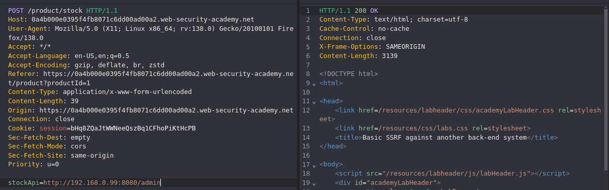

#SSRF 

This lab has a stock check feature which fetches data from an internal system: [link](https://portswigger.net/web-security/ssrf/lab-basic-ssrf-against-backend-system)

In some cases, the application server is able to interact with back-end systems that are not directly reachable by users. These systems often have non-routable private IP addresses. The back-end systems are normally protected by the network topology, so they often have a weaker security posture. In many cases, internal back-end systems contain sensitive functionality that can be accessed without authentication by anyone who is able to interact with the systems.

In the previous example, imagine there is an administrative interface at the back-end URL `https://192.168.0.68/admin`. An attacker can submit the following request to exploit the SSRF vulnerability, and access the administrative interface

this challenge is like the previous challenge
but the difference in this you should to brute force range of IP to get the IP for admin panel 

`http://192.168.0.99:8080/admin/delete?username=carlos`

