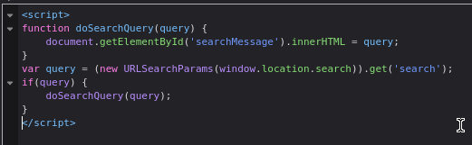

#DOM-XSS 

DOM XSS in `innerHTML` sink using source `location.search` : [link](https://portswigger.net/web-security/cross-site-scripting/dom-based/lab-innerhtml-sink)

This lab contains a DOM-based cross-site scripting vulnerability in the search blog functionality. It uses an `innerHTML` assignment, which changes the HTML contents of a `div` element, using data from `location.search`.

before start talk about challenge we should understand the difference between `innerHTML` and `document.write` :

***document.write :***
 * **What it does**: It writes raw HTML directly into the page.
 * `document.write("");`

***document.innerHTML :***
* **What it does**: It sets the **content** (HTML) of a specific element (like `
`, ``, etc.)
* but it cannot  execute `` directly in the page so you should inject JavaScript functions inside html tags like ``... 

so in this challenge i can't inject `<script>` so the solution is  inject JavaScript function inside HTML tag i prefer work with `` because it easy to use.
this is the vulnerable code :

and this is the payload:
``
