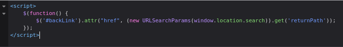

#DOM-XSS 

DOM XSS in jQuery anchor `href` attribute sink using `location.search` source: [link](https://portswigger.net/web-security/cross-site-scripting/dom-based/lab-jquery-href-attribute-sink)

This lab contains a DOM-based cross-site scripting vulnerability in the submit feedback page. It uses the jQuery library's `$` selector function to find an anchor element, and changes its `href` attribute using data from `location.search`.

like we can read on the code below this challenge contain DOM-XSS in  the `attr` function 

it take the value of `windows.location.search` and give it into `#backlink` element so the payload for this challenge is : 
`https://challenge/feedback?returnPath=javascript:alert(1)` 
