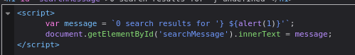

#reflected-xss 

Reflected XSS into a template literal with angle brackets, single, double quotes, backslash and backticks Unicode-escaped [link](https://portswigger.net/web-security/cross-site-scripting/contexts/lab-javascript-template-literal-angle-brackets-single-double-quotes-backslash-backticks-escaped)

This lab contains a reflected cross-site scripting vulnerability in the search blog functionality. The reflection occurs inside a template string with angle brackets, single, and double quotes HTML encoded, and backticks escaped.

I actually solved this challenge by luck.

it like the previous challenges but the difference in the challenge when i read the source code below :

it look like the message invoked inside `${}`
so i try to use `${alert(1)}` inside it to inject it  and it works :)

