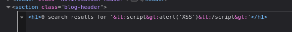
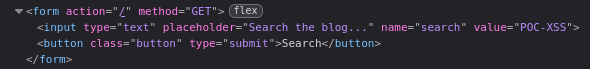

#reflected-xss

Reflected XSS into attribute with angle brackets HTML-encoded: [link](https://portswigger.net/web-security/cross-site-scripting/contexts/lab-attribute-angle-brackets-html-encoded)

This lab contains a reflected cross-site scripting vulnerability in the search blog functionality where angle brackets are HTML-encoded

The difference between this challenge and the previous one is that this time, the HTML characters are encoded. When I type `<` or `>`, they are converted into HTML entities like `&lt;` and `&gt;`, so the browser doesn't interpret them as tags.

When I inspect the page source code, I found that my message was written in another field on the page.

So, I tried to inject `bla" autofocus onfocus="alert('XSS')`.
and it's works :)

