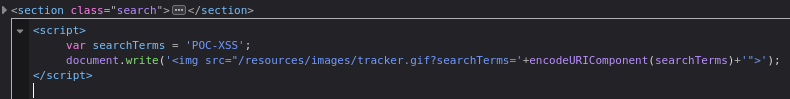
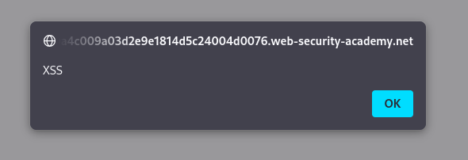

#reflected-xss 

Reflected XSS into a JavaScript string with angle brackets HTML encoded: [link](https://portswigger.net/web-security/cross-site-scripting/contexts/lab-javascript-string-angle-brackets-html-encoded)

This lab contains a reflected cross-site scripting vulnerability in the search query tracking functionality where angle brackets are encoded. The reflection occurs inside a JavaScript string. 

I tried to inject an XSS payload into the search query like in the previous challenges, but it was protected using HTML entity encoding. Also, there was no input field with HTML attributes where I could inject code. However, after exploring the page more, I found this vulnerable code inside the page.

it gives the value of any input into `serachTerms` variable and i tried to inject :
`bla'; alert('XSS'); //`
and it's works :)

