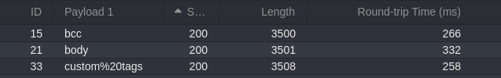
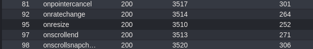

#reflected-xss 

Reflected XSS into HTML context with most tags and attributes blocked: [link](https://portswigger.net/web-security/cross-site-scripting/contexts/lab-html-context-with-most-tags-and-attributes-blocked)

This lab contains a reflected XSS vulnerability in the search functionality but uses a web application firewall (WAF) to protect against common XSS vectors.

In this challenge, there is a WAF (Web Application Firewall) that protects the website by blocking most HTML tags and attributes.
I tried to inject `<b>test</b>`, but it gave me the error message: _"Tag is not allowed"_.  
So, my last option was to try **brute-forcing** different payloads to bypass the filter.

After some brute-forcing, I discovered three valid HTML tags that are allowed, along with some of their attributes :

So I decided to work with the `<body>` tag and its `onresize` attribute.
I injected the payload into the exploit server, and it worked successfully :).
payload: `<iframe src="https://0adf004703959a3080dd1c2200e1000b.web-security-academy.net/?search=cc%3Cbody+onresize%3Dprint%28%29%3E%3C%2Fbody%3E" onload='this.style.width="100px"'></iframe>`
