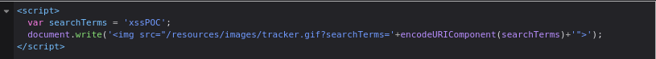
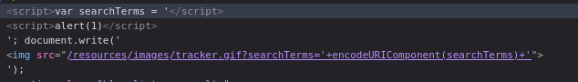
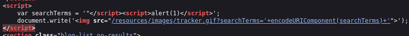

#reflected-xss 

Reflected XSS into a JavaScript string with single quote and backslash escaped:  [link](https://portswigger.net/web-security/cross-site-scripting/contexts/lab-javascript-string-single-quote-backslash-escaped)

This lab contains a reflected cross-site scripting vulnerability in the search query tracking functionality. The reflection occurs inside a JavaScript string with single quotes and backslashes escaped.

In this challenge everything, i type in the search query it goes to `searchTerms`

AS we can see when i write xssPOC it goes to `searchTerms` in the browser, so the payload will be on the `searchTerms` I will close the script and open another one

payload : `</script>` 

and it works :)