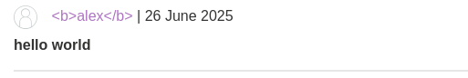

#stored-xss 

Stored XSS into HTML context with nothing encoded: [link](https://portswigger.net/web-security/cross-site-scripting/stored/lab-html-context-nothing-encoded)

This lab contains a stored cross-site scripting vulnerability in the comment functionality.

In this challenge, there is a blog application that stores posts, and you can add comments to any post. 

like we can see on the above image i can inject bold text using `<b>hello world</b>` and every one can see it

now i will try inject ``
and it works :)
