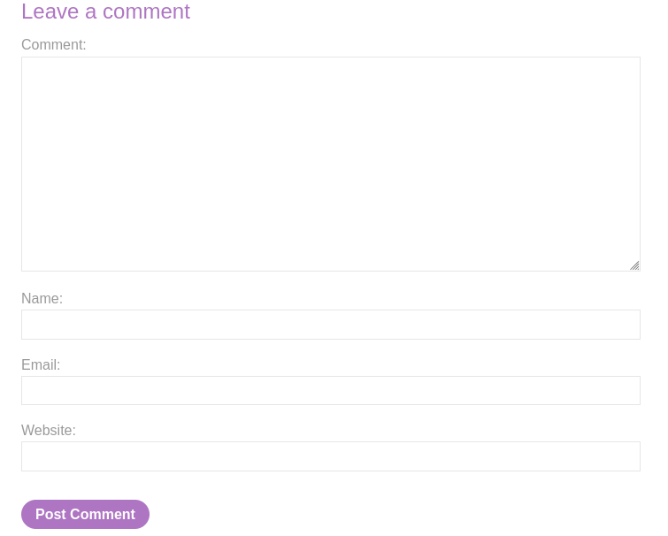
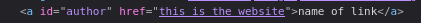

#stored-xss 

Stored XSS into anchor `href` attribute with double quotes HTML-encoded [link](https://portswigger.net/web-security/cross-site-scripting/contexts/lab-href-attribute-double-quotes-html-encoded)

This lab contains a stored cross-site scripting vulnerability in the comment functionality.

In this challenge, everything you write inside the website field is inserted into an `<a href="">` tag, and everything you enter in the name field is used as the link text (the name of the website).

I entered `javascript:alert(1)` in the website field and set the name to "clicked". When I submitted it,
and it works  :)

