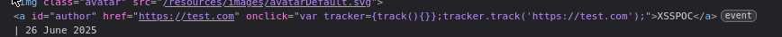

#stored-xss 

Stored XSS into `onclick` event with angle brackets and double quotes HTML-encoded and single quotes and backslash escaped: [link](https://portswigger.net/web-security/cross-site-scripting/contexts/lab-onclick-event-angle-brackets-double-quotes-html-encoded-single-quotes-backslash-escaped)

This lab contains a stored cross-site scripting vulnerability in the comment functionality.

Sometimes, you're trying to inject JavaScript (like `alert(1)`) into a place where **you don’t have full control**, like inside this:
`<a href="#" onclick="var input='YOUR_INPUT_HERE';">`
But sometimes, the website blocks special characters like `'` (single quote), so you can’t escape the string easily.

You can write `'` as `&apos;` (an HTML code for a single quote).  
When the browser sees `&apos;`, it **turns it into `'` automatically**.
So if the website blocks `'`, but **doesn’t block `&apos;`**, you're good.

so in this challenge we have the same problem : 



everything i enter gets added inside the `onclick` attribute, but the problem that i can't use `'` to break the condition they wrote because it escaped using `\` and i can escape it so the solution for this challenge is use HTML entity for `'` it is `&apos;` and this is the payload :
```
name = clicked
website = https://example.com&apos;);alert(1);//
```
