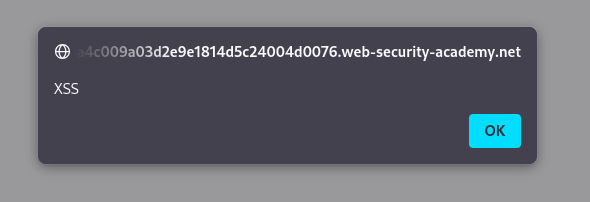

#reflected-xss

Reflected XSS into HTML context with nothing encoded : [Link](https://portswigger.net/web-security/cross-site-scripting/reflected/lab-html-context-nothing-encoded)

This lab contains a simple reflected cross-site scripting vulnerability in the *search* functionality.

As we can see, when I attempt to search for something, like in this example *XSS*, the application directly writes it to the page.

And in the page's source code, as we can see, it is added inside the `<h1>` tag.

When I type `` into the search field, the input is reflected in the page's HTML and executed.

